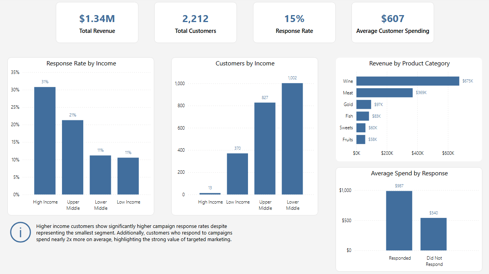
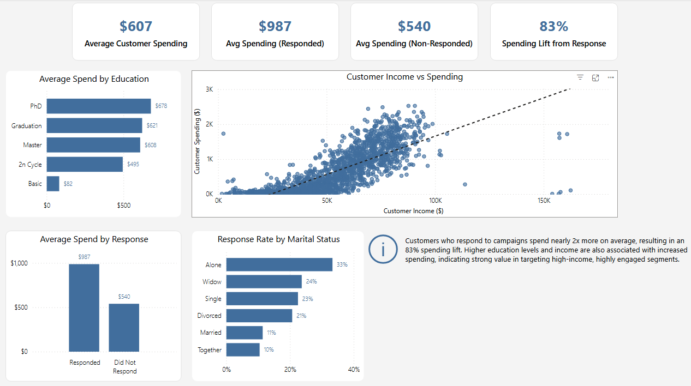

# Marketing Campaign Customer Analysis (Power BI)

## Dashboard Preview

### Executive Overview

---

### Customer Behavior Analysis

---

## Project Overview
This project analyzes customer behavior and marketing campaign effectiveness using Power BI.

The dashboard focuses on:

- Customer segmentation across income, education, and marital status  
- Campaign response behavior across different customer groups  
- Spending patterns and customer value  
- The relationship between income and spending  
- The impact of marketing response on revenue  

The goal was to identify which customer segments drive the most value and how marketing engagement influences spending.

---

## Dataset
The dataset contains customer-level marketing and spending data.

It includes:

- Customer demographics (income, education, marital status, age)  
- Campaign response indicators  
- Product spending across categories  
- Total customer spending  

Key fields include:

- `ID`, `Income`, `Education`, `Marital_Status`  
- `Response`, `AcceptedCmp1–5`  
- `MntWines`, `MntMeatProducts`, `MntFruits`, etc.  
- `Total Spending`  

---

## Data Model
The data was structured to support both customer-level analysis and product-level spending breakdown.

Key components:

- Customer data as the primary table  
- Product spending unpivoted into a separate table for category analysis  
- Measures created to compare behavioral segments (responded vs non-responded)  

This structure enables flexible segmentation and behavioral analysis across customer groups.

---

## Key Metrics

- Total Revenue  
- Total Customers  
- Average Customer Spending  
- Response Rate  
- Average Spend (Responded vs Non-Responded)  
- Spending Lift from Response  

---

## Dashboard Pages

### Executive Overview
- KPI summary of revenue, customers, average spend, and response rate  
- Customer distribution by income  
- Response rate by income  
- Revenue by product category  
- Comparison of spending between responders and non-responders  
- Key business insight  

---

### Customer Behavior Analysis
- Average spending by education level  
- Response rate by marital status  
- Income vs spending relationship (scatter analysis)  
- Spending comparison based on campaign response  
- Key behavioral insight  

---

## Key Insights

- Customers who respond to campaigns spend nearly **2x more**, resulting in an **~83% spending lift**  
- Higher income customers have significantly higher response rates despite being the smallest segment  
- Spending increases with both income and education level, indicating strong value in targeting high-income segments  
- A clear positive relationship exists between income and customer spending  
- Marketing engagement is strongly associated with higher customer value  

---

## Tools Used

- Power BI  
- DAX  
- Power Query  

---
